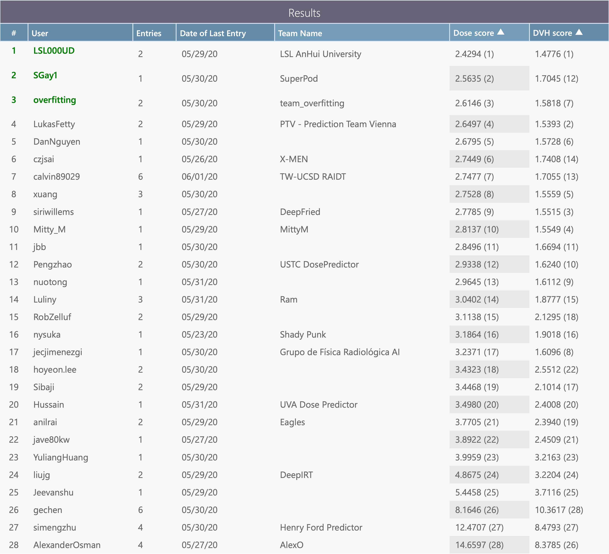

# 🩺 AutoRTDose
*A 3D Transformer Framework for Automated Radiotherapy Segmentation and Dose Distribution Prediction*
  
AutoRTDose is a deep learning framework designed to automate the process of radiotherapy dose distribution prediction and anatomical structure segmentation. Built upon a 3D convolution–transformer hybrid architecture, the model leverages spatial attention and contextual encoding to capture both anatomical and dosimetric correlations from volumetric patient data.

This framework aims to accelerate clinical radiotherapy planning by reducing manual contouring time and improving dose accuracy, offering a scalable and reproducible solution for next-generation, AI-assisted treatment planning.

 


# Table of Contents
- [Data](#data)
- [What this code does](#what-this-code-does)
- [Prerequisites](#prerequisites)
- [Created folder structure](#created-folder-structure)
- [Getting started...](#getting-started)
  + [in Colab](#getting-started-in-colab)
  + [on a local machine](#getting-started-on-a-local-machine)
- [Running the code...](#running-the-code)
  + [in Colab](#running-the-code-in-colab)
  + [on a local machine](#running-the-code-on-local-machine)
- [Competition results](#competition-results)
  + [First place](#first-place)
  + [Runners-up](#runners-up)
  + [Final testing phase leaderboard](#final-testing-phase-leaderboard)
- [Sample research that uses the OpenKBP dataset](#sample-research-that-uses-the-openkbp-dataset)
- [Competition organizers](#competition-organizers)

## Data
The details of the provided data are available in our paper [OpenKBP: The open-access knowledge-based planning grand challenge and dataset](https://aapm.onlinelibrary.wiley.com/doi/epdf/10.1002/mp.14845). In short, we provide data for 340 patients who were treated for head-and-neck cancer with intensity modulated radiation therapy. The data is split into training (*n*=200), validation (*n*=40), and testing (*n*=100) sets. Every patient in these datasets has a dose distribution, CT images, structure masks, a feasible dose mask (i.e., mask of where dose can be non-zero), and voxel dimensions.

## What this code does
This code will train a small neural network to predict dose. There are five PY files that are required to run the _main\_notebook.ipynb_ and _main.py_ files. Below, we summarize the functionality of each PY file, but more details are provided in the files themselves.
  
  - _data_loader.py_: Contains the _DataLoader_ class, which loads the data from the dataset in a standard format. Several data formats (e.g., dose-volume histogram) are available to cater to different modeling techniques.
  - _dose_evaluation_class.py_: Contains the _EvaluateDose_ class, which is used to evaluate the competition metrics.
  - _general_functions.py_: Contain several functions with a variety of purposes. 
  - _network_architectures.py_: Contains the _DefineDoseFromCT_ class, which builds the architecture for a basic U-Net model. This class is inherited by the _PredictionModel_ class. Please note that we intentionally included a network architecture that is **not** state-of-the-art. It is only included to serve as a placeholder for your more sophisticated models. 
  - _network_functions.py_: Contains the _PredictionModel_ class, which applies a series of methods on a model constructed in _DefineDoseFromCT_. 

## Prerequisites
The following are required to run the given notebook, however, you may use any hardware or software you'd like. 

### For running on Google Colab
- Standard Google account 

### For running on a local machine
- Linux
- Python 3.10.9
- NVIDIA GPU with CUDA and CuDNN (recommended)


## Created folder structure
This repository will create a file structure that branches from a directory called _open-kbp_. The file structure will keep information about predictions from a model (called baseline in this example) and the model itself in the _results_ directory. All the data from the OpenKBP competition (with the original train/validation/test splits) is available under the directory called _provided-data_. This code will also make a directory called _submissions_ to house the zip files that can be submitted to the leader boards on CodaLab. Use this folder tree as a reference (it will more or less build itself).
   
```
open-kbp
├── provided-data
│   ├── train-pats
│   │   ├── pt_*
│   │       ├── *.csv
│   ├── valid-pats
│   │   ├── pt_*
│   │       ├── *.csv
│   └── test-pats
│       ├── pt_*
│           ├── *.csv
├── results
│   ├── baseline
│   │   ├── models
│   │   │   ├── epoch_*.h5
│   │   ├── validation-predictions
│   │   │   ├── pt_*.csv
│   │   └── test-predictions
│   │       ├── pt_*.csv
│   ├── **Structure repeats when new model is made**
└── submissions
    ├── baseline.zip
    ├── **Structure repeats when new model is made**   

```

## Getting started
 Below, we provide instructions for setting up this repository in Google Colab and on a local machine. 
   
### Getting started in Colab
This should be the simplest way to compete in OpenKBP because the software required for dose prediction is installed in the cloud. It also means you can be competitive in OpenKBP without expensive hardware. 

1. Head to <a href="https://colab.research.google.com" _target='blank'>Colab</a>
1. Select 'GitHub' &rarr; paste the link to <a href="main_notebook.ipynb" _target='blank'>`main_notebook.ipynb`</a> &rarr; ENTER &rarr; click the file name
1. In the Google Colab toolbar select: Runtime &rarr; Change Runtime. This will open another popup where you should ensure the runtime type is Python 3 and the hardware accelerator is GPU.

You're all set for executing the code.

### Getting started on a local machine
1. Make a virtual environment and activate it
    ```
    virtualenv -p python3 open-kbp-venv
    source open-kbp-venv/bin/activate
    ```
2. Clone this repository, navigate to its directory, and install the requirements. Note, that to run Tensorflow 2.1 with a GPU, you may need to build Tensorflow 2.1 from source. The official instructions to build from source are [here](https://www.tensorflow.org/install/source), but I found the third party guide [here](https://gist.github.com/kmhofmann/e368a2ebba05f807fa1a90b3bf9a1e03) more useful. 

    ```
    git clone https://github.com/ababier/open-kbp
    cd open-kbp
    pip3 install -r requirements.txt
    ```

## Running the code
Running the code in either platform should be straightforward. Any errors are likely the result of data being in an unexpected directory. If the code is running correctly then the progress of the neural network should print out to an output cell (Colab) or the commandline (local machine).
 
### Running the code in Colab
In the Google Colab toolbar select: Runtime > Run all; you can also use the key-binding <Ctrl+F9>.

**OR**

Run each cell individually by clicking the play button in each cell; you can also use the key binding <Shift+Enter> to run a highlighted cell.

### Running the code on local machine
Run the main file in your newly created virtual environment.
    ```
    python3 main.py
    ```
Alternatively, you may run the notebook in Jupyter Notebook or Jupyter Lab locally, but only after commenting out the commands related to Google Drive and changing the paths for where the provided data is stored and where the results are saved.

## Competition results
The OpenKBP Challenge attracted 195 participants from 28 counties. The competition started February 21, 2020 and concluded on June 1, 2020. A total of 1750 submissions were made to the validation phase by the 44 teams (consisting of 73 people) who made at least 1 submission. In the testing phase, 28 teams (consisting of 54 people) made submissions. The top teams in this competition are highlighted below. **Note that the dose for patients in the validation and testing data was only published on June 23, 2020 after the Challenge concluded.  

### First place

**Dose and DVH Stream**: Shuolin Liu, Jingjing Zhang, Teng Li1, Hui Yan, Jianfei Liu, *LSL AnHui University*, Anhui University, China. [\[GitHub Repository\]](https://github.com/LSL000UD/RTDosePrediction) [\[Paper\]](https://aapm.onlinelibrary.wiley.com/doi/full/10.1002/mp.15034)

### Runners-up

**Dose Stream**: Mary P. Gronberg, Skylar S. Gay, Tucker J. Netherton, Dong Joo Rhee, Laurence E. Court, Carlos E. Cardenas, *SuperPod*, MD Anderson Cancer Center, United States. [\[Paper\]](https://aapm.onlinelibrary.wiley.com/doi/full/10.1002/mp.14827) 

**DVH Stream**: Lukas Zimmermann, Erik Faustmann, Christian Ramsl, Dietmar Georg, Gerd Heilemann, *PTV - Prediction Team Vienna*, Medical University of Vienna, Austria. [\[Paper\]](https://aapm.onlinelibrary.wiley.com/doi/full/10.1002/mp.14774)
 
### Final testing phase leaderboard 
This leaderboard contains the final results of this challenge, which is the first controlled and blinded test of KBP method implementations from several institutions. 
 
 

 Researchers can still sign up and submit to a live leaderboard on [CodaLab](https://competitions.codalab.org/competitions/?q=openkbp). However, **since the results are no longer blinded there is no way to ensure the validation and test set was used as intended (i.e., without any peaking at test data)**. 

## Sample research that uses the OpenKBP dataset
 - D. Nguyen, A.S. Barkousaraie, G. Bohara, A. Balagopal, R. McBeth, M. Lin, S. Jiang, "[A comparison of Monte Carlo dropout and bootstrap aggregation on the performance and uncertainty estimation in radiation therapy dose prediction with deep learning neural networks](https://iopscience.iop.org/article/10.1088/1361-6560/abe04f)," _Physics in Medicine & Biology_, Vol. 60, p. 054002, 2021.
- I. Isler, C. Lisle, J. Rineer, P. Kelly, D. Turgut, J. Ricci, U. Bagci, "[Enhancing Organ at Risk Segmentation with Improved Deep Neural Networks](https://arxiv.org/abs/2202.01866)," arXiv:2202.01866, 2022.

## Competition organizers
OpenKBP was organized by Aaron Babier, Binghao Zhang, Rafid Mahmood, and Timothy Chan (University of Toronto, Canada); Andrea McNiven and Thomas Purdie (Princess Margaret Cancer Center, Canada); Kevin Moore (UC San Diego, USA). This challenge was supported by [The American Association of Physicists in Medicine](https://www.aapm.org/GrandChallenge/OpenKBP/). 

