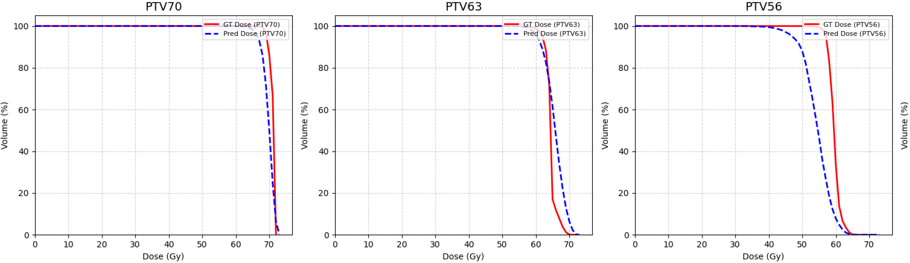
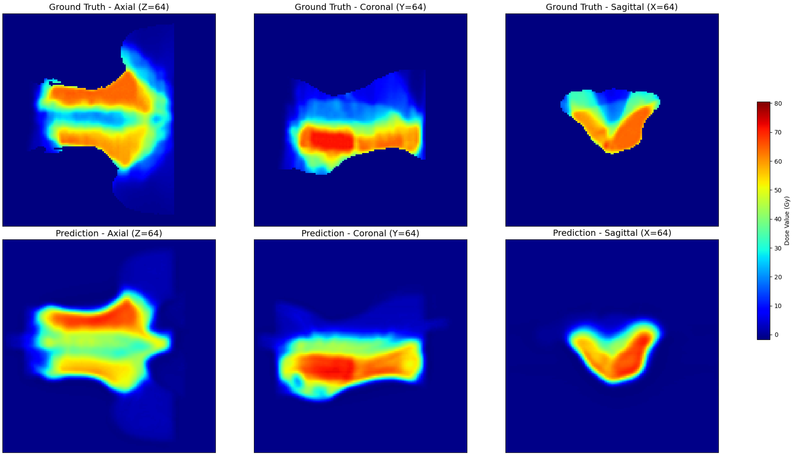

# 🩺 AutoRTDose: A _3D_ Transformer Framework for Automated Radiotherapy Segmentation and Dose Distribution Prediction
<p align="justify">
Radiotherapy planning for head and neck cancer is a labour-intensive process that requires precise delineation of organs-at-risk (OARs) and the accurate estimation of dose distributions. Conventional deep learning pipelines often rely solely on convolutional neural networks, which struggle to capture the long-range spatial dependencies that influence clinical dose decisions. At the same time, fully 3D transformer models remain prohibitively expensive to train due to the high dimensionality of volumetric medical data. <b>AutoRTDose</b> addresses this challenge through a hybrid architecture that couples a <b>3D U-Net backbone</b> for rich spatial feature extraction with a <b>super-patch transformer module</b> designed to model contextual relationships across distant anatomical regions. The 3D U-Net efficiently captures fine-grained structural detail within the CT volume, while the transformer integrates global context by operating on learned super-patch embeddings rather than entire volumetric slices, significantly reducing computational overhead.
</p>

<div style="text-align: justify">
This design enables the framework to:

- <b>Automatically segment OARs and target structures</b> with clinically relevant precision;

- <b>Predict voxel-wise radiotherapy dose distributions</b> that maintain anatomical consistency;

- <b>Model long-range dose influence patterns</b>, particularly critical in head and neck treatment where steep gradients and complex organ interactions are common.

AutoRTDose provides a scalable and practical foundation for advancing AI-assisted radiotherapy planning, supporting both research development and potential translation into clinical workflows.
</div>

 

<div align="center">
  
  <p><em>Figure: Dose–Volume Histogram comparison between ground truth and predicted dose distribution.</em></p>

  
  <p><em>Figure: Axial slice comparison showing spatial alignment between ground truth and predicted dose.</em></p>
</div>


---

## ⚙️ Installation & Environment Setup
Clone the repository:
```bash
git clone https://github.com/MUZAMMILATEO/AutoRTDose.git
cd AutoRTDose
```

To ensure reproducibility, we recommend creating a dedicated Conda environment:
```bash
conda create -n AutoRTDose python=3.10 -y
conda activate AutoRTDose
```

Upgrade pip and install the required dependencies:
```bash
pip install --upgrade pip
pip install torch==2.7.1 torchvision==0.22.1 torchaudio==2.7.1 --index-url https://download.pytorch.org/whl/cu118
pip install -r requirements.txt
```

## 📦 Dataset Acquisition

This framework utilises the OpenKBP (Open Knowledge-Based Planning) dataset for radiotherapy dose prediction research. Please download the dataset from the official repository:
```bash
git clone https://github.com/ababier/open-kbp.git
```

After downloading, locate the folder named `provided_data`, and copy or move this folder into the root directory of this project (i.e., the main AutoRTDose folder).


## 🧩 Data Preparation & Visualisation
Convert the raw OpenKBP dataset into the processed format required by the framework:
```bash
python ./provided_code/transform_data.py ./provided-data/
```

Optionally visualise the transformed patient data:
```bash
python ./provided_code/visualize_transform_data.py ./transformed-data/train-pats/pt_125
```

## 🎨 Generation of Overlaid 3D Volumes

Create multi-channel overlaid volumes for dose prediction:
```bash
python ./provided_code/create_overlaid_volumes.py /home/khanm2004/dose_prediction/open-kbp/transformed-data
```

Visualise an example overlay:
```bash 
python ./provided_code/visualize_overlaid_patient.py /home/khanm2004/dose_prediction/open-kbp/overlaid-data/train-pats/pt_1
```

## 🏋️ Model Training

Train the AutoRTDose model:
```bash
cd 3DConvTransformer
python train.py
```

## 🔮 Dose Prediction
Predict dose for a single patient:
```bash
python predict.py ../overlaid-data/test-pats/pt_1
```

Predict dose for all patients in the test set:
```bash
python predict.py ../overlaid-data/test-pats/
```

## 📊 Evaluation

Evaluate model performance for a single patient:
```bash
python eval.py ../overlaid-data/test-pats/pt_241
```

Evaluate for all test patients:
```bash
python eval.py ../overlaid-data/test-pats/
```

---

## 📚 Citation

If you use **AutoRTDose** in your research, please cite:

**Muzammil Khan**, *AutoRTDose: A 3D Transformer Framework for Automated Radiotherapy Segmentation and Dose Distribution Prediction*, 2025.  
Available at: https://github.com/MUZAMMILATEO/AutoRTDose.git

```bibtex
@misc{khan2025autortdose,
  title        = {AutoRTDose: A 3D Transformer Framework for Automated Radiotherapy Segmentation and Dose Distribution Prediction},
  author       = {Khan, Muzammil and Siepel, Françoise},
  year         = {2025},
  institution  = {University of Twente, Robotics and Mechatronics (RaM), TechMed Centre},
  howpublished = {\url{https://github.com/MUZAMMILATEO/AutoRTDose.git}},
  note         = {Version 0.0},
}
```